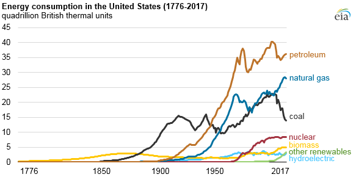
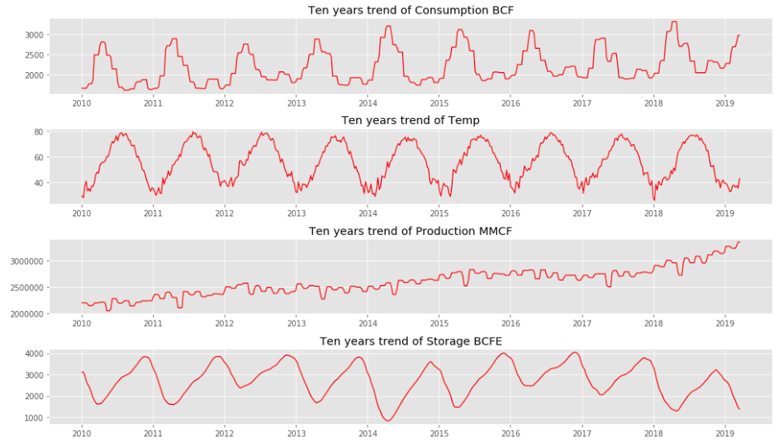
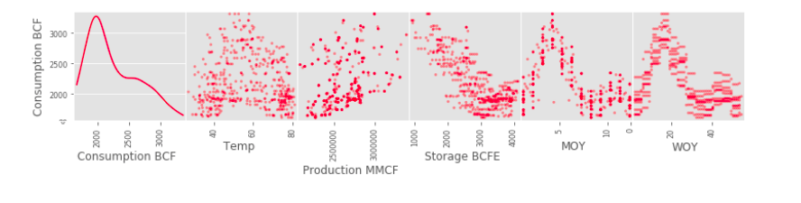

# Natural-Gas-Demand-Prediction
# Motivation
Natural gas account for 1/4 of the global demand and roughly 1/3 of the US energy demand. After oil, Natural gas is the most dominad sort of energy. So, being about to improve natural gas demand prediction is extremely valuable. This will allow midstream companies to optimize their storage capacity, strategically plan for future demand, and lower the risk of energy shortage.

Therefore, this project aims to predict the demand of Natural Gas in the US by combining a wide range of datasets including the Hery Hub Natural Gas spot price, US weather averages (daily), US Natural Gas storage (weekly) and production (monthly), US population (Annually), and Import & Exports (Monthly) for the last 10 years.

# Data Sources
- For the Hery Hub Natural Gas spot price, Import & Exports (Monthly), and storage data (weekly), I used csv data from the US Energy Information Administration website. https://www.eia.gov/naturalgas/
- For the US weather averages (daily), I used the Climate Engine database. https://app.climateengine.org/
- For the US population (annually), I used the bureau of the census database. https://www.census.gov/
    
# Methodology

    

# Combining Data Sources

Combining the information from multiple data sources was probably the most time consuming portion of the project. The data sampling varies and in some cases, it is very sparse. Data releases differ from the dates of collection, and releases are always different. Finally, energy demand around the US is not homogenous. The data was adjusted to allocate more weight to regions with higher demand.

  
    
# Exploratory Data Analysis

From basic exploratory analysis, I found that:
- The `temperature` plot shows very strong oscillations aligned with seasonality in the northern hemisphere. 
- The `production` plot shows a general increase over time, probably influenced by the increase in shale plays production efficiencies.
- The `storage` plot shows very strong oscillations aligned with seasonality in the northern hemisphere. In general, storage levels decrease during the winter and increase during the summer.
- The `consumption` plot shows very strong oscillations aligned with seasonality in the northern hemisphere. In general, natural gas consumption levels increase during the winter and decrease during the summer.

    
Additionally, there is not a clear linear relation between consumption and any of the other features. 

Through this analysis, I determined that using traditional time-series and tree-based models provided the best solution to reproduce an explainable and quick model.

# Modelling
    
