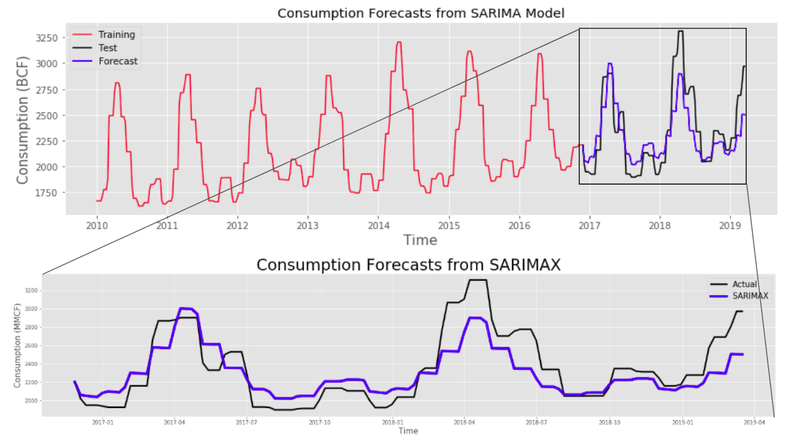
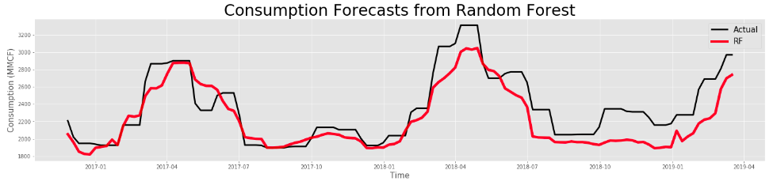
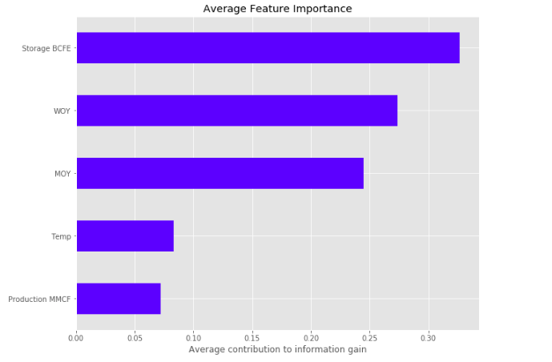
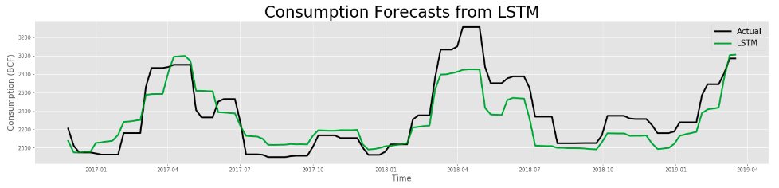

# Natural-Gas-Demand-Prediction
See this work as a presentation in [Google Slides](https://docs.google.com/presentation/d/1w2h3zgJHY40Ypa2mmqZrOASIHWp1PxDaszOf5De0p0o/edit?usp=sharing).

[See the video](https://youtu.be/TjZny7qr9mA) of this talk.

---

# Motivation
Natural gas account for 1/4 of the global demand and roughly 1/3 of the US energy demand. After oil, Natural gas is the most dominad sort of energy. So, being about to improve natural gas demand prediction is extremely valuable. This will allow midstream companies to optimize their storage capacity, strategically plan for future demand, and lower the risk of energy shortage.

Therefore, this project aims to predict the demand of Natural Gas in the US by combining a wide range of datasets including the Hery Hub Natural Gas spot price, US weather averages (daily), US Natural Gas storage (weekly) and production (monthly), US population (Annually), and Import & Exports (Monthly) for the last 10 years.
    

  

# Data Sources
- For the Hery Hub Natural Gas spot price, Import & Exports (Monthly), and storage data (weekly), I used csv data from the US Energy Information Administration website. https://www.eia.gov/naturalgas/
- For the US weather averages (daily), I used the Climate Engine database. https://app.climateengine.org/
- For the US population (annually), I used the bureau of the census database. https://www.census.gov/
    
# Methodology

  

      

# Combining Data Sources

Combining the information from multiple data sources was probably the most time consuming portion of the project. The data sampling varies and in some cases, it is very sparse. Data releases differ from the dates of collection, and releases are always different. Finally, energy demand around the US is not homogenous. The data was adjusted to allocate more weight to regions with higher demand.

  

  
    
# Exploratory Data Analysis

From basic exploratory analysis, I found that:
- The `temperature` plot shows very strong oscillations aligned with seasonality in the northern hemisphere. 
- The `production` plot shows a general increase over time, probably influenced by the increase in shale plays production efficiencies.
- The `storage` plot shows very strong oscillations aligned with seasonality in the northern hemisphere. In general, storage levels decrease during the winter and increase during the summer.
- The `consumption` plot shows very strong oscillations aligned with seasonality in the northern hemisphere. In general, natural gas consumption levels increase during the winter and decrease during the summer.

    
Additionally, there is not a clear linear relation between consumption and any of the other features. 

Through this analysis, I determined that using traditional time-series and tree-based models provided the best solution to reproduce quick and explainable products.

# Modelling

### ARIMA and SARIMAX
After collecting, combining and curating the data, I decided to utilize the last 10 years of data for my work. Roughly 8 years were used for training and 2 years for testing for all models. I used R^2 as the metric to compare models performance due to its ability to quantify the degree that my model accounts for variation in the data.  

For Traditional time series models, I used ARIMA and SARIMAX models. Through the process of making the data stationary and understanding the autocorrelation at lag, I discovered that ARIMA was not going to be able to work. The strong seasonal component intrinsic of this dataset make it difficult for the ARIMA model to work. In this case, the SARIMAX model provides better predictability power. The parameters I used for the SARIMAX model are Auto Regressive (AR) p: 1, Differencing d: 1, Moving Average (MA) q: 1, Seasonal Auto Regressive sp: 1, Seasonal Differencing sd: 0,  Seasonal Moving Average sq: 1, and number of periods m: 52. 

Overall this basic model is able to predict at the beginning, but as time goes by, the predictability power starts declining. 

  

### Tree Based Models
For tree based models, I tested on random forests (R^2: 0.70) and gradient boosting (R^2: 0.71). The two models outperformed the SARIMAX model (R^2: 0.69) by a few points in term of R^2, but between the two of them, there was not significant difference. You can also see that storage, month of the year, and week of the year are the most important features for tree based to make decisions for this particular dataset. This is not surprising due to the strong seasonality component of this data. 

  

  

### Neural Network
Finally, I ran some recurrent neural nets, specifically long short term memory (LSTM). This model performed much better than any previous model (R^2: 0.76) and it is able to follow the trends and magnitude of the test data very well. The way that LSTM models work is by feeding back the output of a neural network layer at time t to the input of the same network layer at time t + 1. 

  

Overall, the 3 models are able to predict fairly well. The LSTM model performs the best out of all of them, but Random forest does a good job at capturing the overall structure of the testing data.

# Next Steps
- Develop a database with current data.
- Automate data gathering for future data and update models weekly.
- Create a dashboard with relevant information for decision makers.
